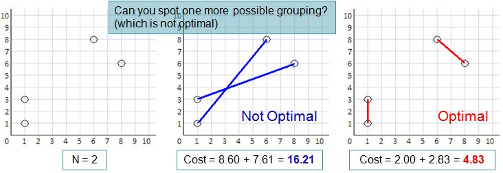

# Chapter 1 - Introduction
>
> Tôi muốn được tham dự kì thi ICPC World Finals!

## Lập Trình Thi Đấu

Cốt lõi của cụm từ "Lập trình thi đấu" đó chính là: "Cho những bài toán đã biết về KHMT (Khoa học máy tính), hãy giải quyết các bài toán đó một cách nhanh (tối ưu) nhất!"

Chúng ta hãy tiến hành phân tích khái niệm trên thành từng phần. Đầu tiên, "những bài toán đã biết về KHMT" có nghĩa là trong lập trình thi đấu, chúng ta chỉ giải quyết các bài toán đã được biết chứ không phải nghiên cứu (*research*) những bài toán chưa biết câu trả lời. Sẽ có những người (ít nhất là tác giả của bài toán) đã từng giải những bài toán này rồi. Để "giải quyết các bài toán", chúng ta cần phải sử dụng những kiến thức lập trình cần thiết để tạo ra mã nguồn để giải quyết vấn đề này - ít nhất là phải đưa ra đúng output mong muốn trong 1 khoảng thời gian được quy định. Tại sao "một cách tối ưu nhất, nhanh nhất" lại cần thiết đến vậy? Vì yếu tố tốc độ là yếu tố then chốt cấu thành nên tính chất "thi đấu" - tốc độ luôn là mục tiêu mà con người hướng đến.

---

Ví dụ minh họa: UVa Online Judge [44] Problem Number 10911 (Forming Quiz Teams). Tóm lược bài toán:

Điểm (x, y) là tọa độ của nhà riêng của học sinh trên mặt phẳng. Có 2*N* học sinh và chúng ta bắt cặp thành *N* nhóm. Gọi *di* là khoảng cách giữa 2 nhà của 2 học sinh trong nhóm *i*. Hãy tạo N nhóm sao cho tổng các khoảng cách là **bé nhất**. In ra kết quả là số float có 2 giá trị phần thập phân. Cho biết 1 &le; *N* &le; 8 và 0 &le; *x, y* &le; 1000.

**Sample input**:
*N* = 2; Các tọa độ của 2N = 4 ngôi nhà là {1, 1}, {8, 6}, {6, 8} và {1, 3}.

**Sample output**:
*chi phí* = 4.83

Bạn có giải được bài toán này không?
Nếu bạn giải được thì bạn nghĩ bạn sẽ mất bao nhiêu thời gian để code?
Hãy thử suy nghĩ, đừng vội đọc tiếp!

*Ảnh 1.1: Minh họa đề bài UVa 10911*

Và bây giờ bạn hãy tự nghĩ: Mô tả nào dưới đây đúng nhất về bạn? Lưu ý rằng nếu bạn còn cảm thấy mơ hồ về những nội dung và thuật ngữ được trình bày trong chương này, bạn hoàn toàn có thể quay trở lại sau khi hoàn thành quyển sách này.

* Lập trình viên A (Không lập trình thi đấu, gà mờ):

Bước 1: Đọc bài toán và không hiểu gì cả (Đây là bài toán hoàn toàn mới đối với A).
Bước 2: Thử code gì đó.
Bước 3: A nhận ra rằng cả 2 ý tưởng sau đều không **AC**: **Tham lam** (Phần 3.4): Lặp đi lặp lại việc ghép đôi giữa 2 học sinh còn lại với khoảng cách ngắn nhất cho kết quả **WA**.
**Vét cạn** ngây thơ: Sử dụng kĩ thuật quay lui đệ quy thử tất cả các trường hợp. Kết quả **TLE**.

* Lập trình viên B (Không lập trình thi đấu, bỏ cuộc):

Bước 1: Đọc bài toán và nhận ra đây là một bài toán ghép cặp. Nhưng B chưa học cách giải các bài toán dạng này... B không nghĩ tới phương pháp **Quy Hoạch Động (Dynamic Programming - DP)** (Phần 3.5)...
Bước 2: Bỏ qua bài toán làm bài khác.

* Lập trình viên C (Không lập trình thi đấu, làm chậm):

Bước 1: Đọc bài toán và nhận ra đây là một bài toán khó dạng **Cặp ghép hoàn hảo có trọng số nhỏ nhất trên đồ thị đầy đủ có trọng số**. Tuy nhiên với input nhỏ, bài toán có thể giải quyết bằng DP. Bài toán con
